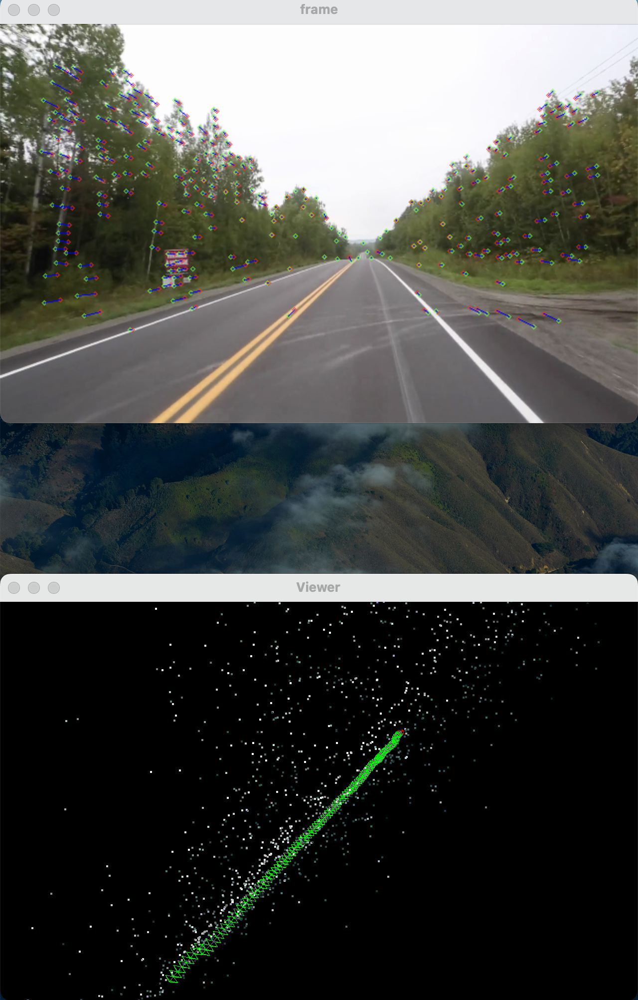

# My-Slam

## 1 Introduction

We use python to code a SLAM(Simultaneous localization and mapping), which is a technique of constructing or updating a [map](https://en.wikipedia.org/wiki/Map) of an unknown environment while simultaneously keeping track of an [agent](https://en.wikipedia.org/wiki/Intelligent_agent)'s location within it. In this repository, we will use Pangolin and OpenCV to build a slam for fun.

I'm a beginner and learning about computer vision and SLAM. So there might be some problem in our code.

### 1.1 Example





### 1.2 Why Python?

First, I am not a CPP coder, and there is lots of convenient tool which we can use to build python, for example: Pangolin, OpenCV, G2O, Scipy. They contains lots of the API which can process image and Epipolar Geometry problem.

Second, we decide to use deeplearning net work to improve the performance in camera pose estimation, keypoints matching and pose graph optimization. 

### 1.3 Current work

1. Match the keypoints between two frames
2. Use ransac algorithm to filter the unmatched keypoints(it seems we have got some good paramters)
3. Get the camera pose from the essential matrix
4. Display the track of the keypoints in 2D
5. Display the camera position in 3D by using pangolin

### 1.4 TODO

1. Triangulate points we get from the current frame
2. Get the depth and build the points in 3D
3. Extract the color of the points and show the points
4. (Should we add a new class to track the points?)

### 1.5 What am I doing

Now I am tring to implement a `triangulate` function to do points triangulation, I don't want to use `cv2.triangulatePoints`  to do that(I want get a deeper understanding in the coordinate transform). First, I use the intrinsic of camera(3*3 matrix) to transfer the position of points from pixel coordinate to camera coordinate. Then I use RT matrix to project the points from camera to 4D. According to the principe of homogeneous coordinates, get the 3D location of the points. Still bugs!! I have no ideas where it's wrong.. Maybe I should check the parameters of the instrincs matrix.

### 1.6 Run the code

```sh
# ./slam.py camera_focal Video_path
./slam.py 525 data/test_countryroad.mp4cs
```

 

## 2 Prerequisites

```txt
numpy==1.24.1
opencv_python==4.7.0.68
PyOpenGL==3.1.6
pypangolin==0.8
scikit_image==0.19.3
skimage==0.0
```

### 2.1 Pangolin

We use pangolin for visualization and display 3D view. Pangolin is a good tool which can set camera and display 3D points.

You can install pypangolin(python version pangolin) in this link: https://github.com/sisuy/pangolin. Here I fixed some issues in the original repository.

Thanks the all the contibutor in pangolin community, if you are insterested in pangolin, please see here: https://github.com/stevenlovegrove/Pangolin

### 2.2 OpenCV

We use OpenCV to display 2D image, and use some function in CV2 to track the feature keypoints(ORB and SIFT).  Use Cv2 to estimate the camera pose.

In the future, we intend to change the method of pose estimation and match point algorithm. Use deeplearning model to get a higher accuracy performance.

Please see more details in these papers:

1. [SuperPoint: Self-Supervised Interest Point Detection and Description](https://arxiv.org/abs/1712.07629)
2. [Introduction to Camera Pose Estimation with Deep Learning](https://arxiv.org/abs/1907.05272v1)


## 3 Project files

### 3.1 slam.py

It contains a main function and a Slam class. We use slam class to store the point map information and the information of each frames in the video.

We use `process_frame`  function to process the frame. By using this function, we can extract the matched points and camera pose in a specific frame.

We use `match_frames` function to get a essential matrix between two frames(Using ransac algorithm, more details see here: https://en.wikipedia.org/wiki/Random_sample_consensus). To clean the noise in the essential matrix, we use SVD method to decomposition the essential matrix, and set the third pivot of Singular value matrix as 0. Finally, we can get the camera pose from the rebuild essential matrix and the pose we get from the lase frame. 

### 3.2 frame.py

It contains a Frame class used to store the information in a specific frame.

Everytime we build a `Frame` object, it will find the keypoints in this frame by using ORB algorithm. A function called `Frame.Add_keyPoints()` will return the keypoints and descriptors.


### 3.3 display.py

It contains Display2D and Display3D class.

Display2D class is used to display the 2 dimensional image which is annotated the keypoints and the track of the keypoints.

Display3D class is used to display the 3 diemensional scene, which use pangolin lib to display the position of camera and the 3D points we get from each frames.


If you want to join me, please contact me.
